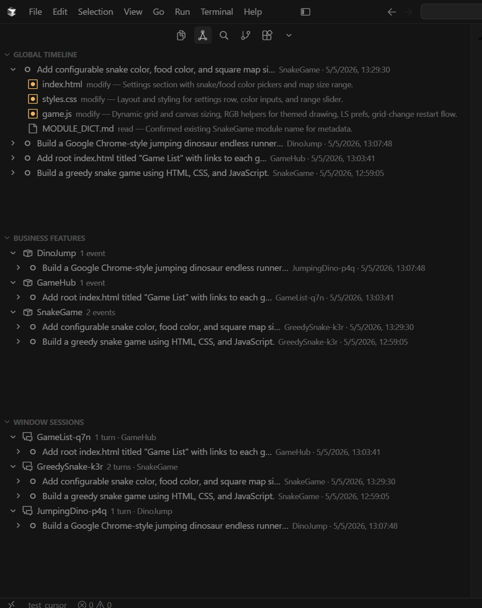
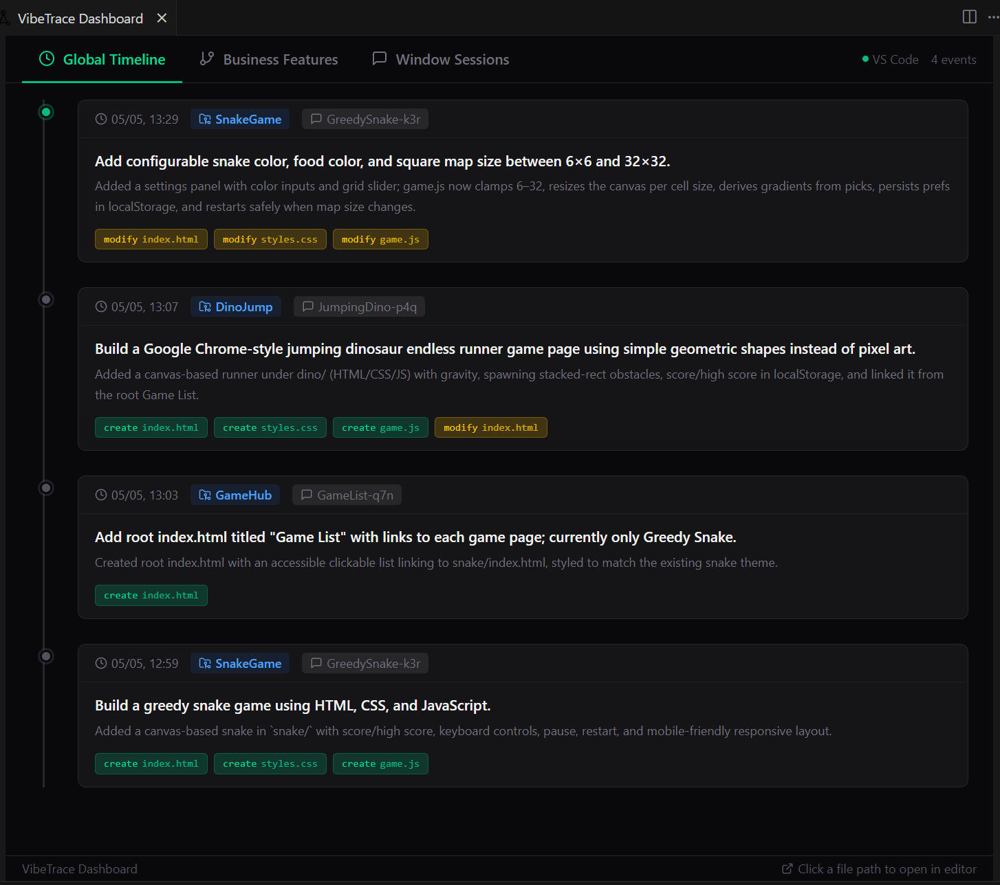
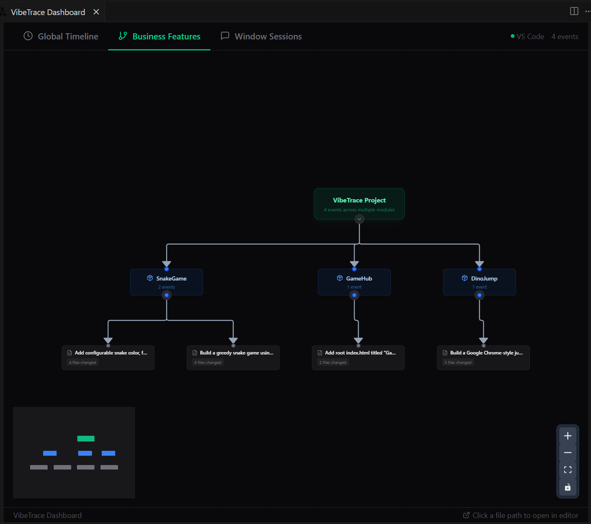
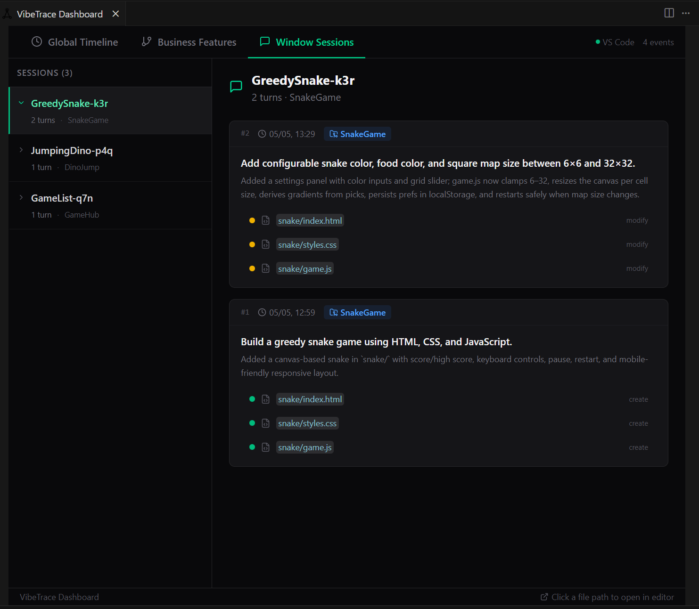

# VibeTrace

> Vibe-coding process chain recorder & visualizer — never lose context across agent windows.

[中文文档](README_CN.md)

VibeTrace is a VS Code-compatible extension that automatically records and visualizes your AI-assisted coding journey. Every time an AI agent finishes a code change, it generates a lightweight metadata record. VibeTrace collects these records and presents them as an interactive timeline, business feature graph, and session chain — right inside your editor.

## Why VibeTrace?

Imagine this: you've been vibe-coding a project in Cursor for a week. After a weekend away, you open the project again — and you're faced with a sea of chat windows and AI-generated code that now looks completely foreign. It's overwhelming.

- Want to know what happened in a specific chat window? You have to slowly scroll through the entire conversation history.
- A business feature may have been built across multiple chat windows. When you need to review how that feature was implemented, you have to hunt through every window.
- Want to share your vibe-coding project with others? Nobody wants to read piles of AI-generated code — but your vibe-coding journey is the most compelling part.
- When switching to a new AI or a new window to continue working, if the AI has a complete record of the project's prior development flow, it can understand the project much better.

That's why VibeTrace exists.

## Screenshots

The plugin provides three core views:

#### Global Timeline

A chronological feed of every AI conversation turn across all sessions and modules. Click any event to see intent, summary, and impacted files.

#### Business Features

A React Flow tree graph showing how AI conversations map to business feature modules (Root → Module → Intent Node). Collapse/expand parent nodes, click nodes for details, drag to pan.

#### Window Sessions

Conversations grouped by session window — each AI chat window gets its own chain, so you can trace the full context of a multi-turn session.

The plugin offers two visualization modes, shown here in Cursor:

- Editor-native views

  

- Web Dashboard

  

  

  

## Key Features

* **Zero-config AI recording:** AI handles everything — you don't need to manage anything. The plugin silently processes every conversation, building your vibe footprint.
* **Module auto-classification:** AI self-maintains business feature conversation records, intelligently classifying work into feature modules. No more getting lost when reviewing how a feature was built.
* **File impact tracking:** Records every file created, modified, deleted, or referenced in each turn.
* **Unresolved issues flagging:** AI can mark incomplete work for follow-up.
* **Seamless editor integration:** Click any impacted file path to open it directly. Right-click to rename sessions or correct module classifications.

## Supported Editors

| Editor | Rules File |
|--------|-----------|
| Cursor | `.cursor/rules/vibetrace-core.mdc` |
| Codex | `AGENTS.md` |
| Trae | `.trae/rules/project_rules.md` |

## How It Works

1. **Initialize** — Click the "Initialize VibeTrace" button in the sidebar. Pick your editor. VibeTrace creates the rules file and `.vibe/events/` directory.
2. **AI Auto-Records** — The injected rules instruct the AI to write a JSON metadata file to `.vibe/events/` after every code-changing conversation turn.
3. **Visualize** — VibeTrace watches the directory and renders three live views.

## Features

- **Zero-config AI recording** — Rules are auto-injected; AI handles the rest
- **Module auto-classification** — AI reads `.vibe/MODULE_DICT.md` to classify work into feature modules
- **File impact tracking** — Every created, modified, deleted, or referenced file is recorded per turn
- **Unresolved issues flagging** — AI can mark incomplete work for follow-up
- **In-editor file opening** — Click any impacted file path to open it directly
- **Session renaming** — Give session windows human-readable names
- **Module correction** — Fix misclassified events with a right-click

## Installation

Download the `.vsix` from [Releases](https://github.com/zpeakj/vibe-trace/releases) and install via:

```
code --install-extension vibetrace-0.1.0.vsix
```

Or in VS Code: `Ctrl+Shift+P` → "Extensions: Install from VSIX..."

## Usage

1. Open your project in Cursor / Codex / Trae
2. Click the VibeTrace icon in the activity bar
3. Click **"Initialize VibeTrace"** and select your editor
4. Start chatting with AI — events appear automatically

### Commands

| Command | Description |
|---------|------------|
| `VibeTrace: Initialize` | Set up VibeTrace for the current project |
| `VibeTrace: Open Dashboard` | Open the full React webview dashboard |
| `VibeTrace: Refresh Views` | Manually refresh all tree views |
| `VibeTrace: Setup AI Rules File` | Re-generate the rules file |
| `VibeTrace: Edit Module Name` | Correct an event's module classification |
| `VibeTrace: Rename Session` | Give a session a readable name |
| `VibeTrace: Copy Rules to Clipboard` | Copy the raw rules for manual setup |

## Metadata Format

AI generates JSON files in `.vibe/events/`:

```json
{
  "id": "20260505-LoginPage-k7m-x9k",
  "session_id": "LoginPage-k7m",
  "module": "Auth",
  "intent": "Add WeChat QR code login button to the login modal",
  "summary": "Added WeChatOAuth component, wired up QR code generation, and updated auth store",
  "impactFiles": [
    { "path": "src/components/WeChatOAuth.tsx", "action": "create", "description": "QR code login component" },
    { "path": "src/store/auth.ts", "action": "modify", "description": "added wechat_openid field" }
  ],
  "unresolved_issues": "Backend OAuth callback endpoint needs to be configured"
}
```

The `timestamp` field is auto-stamped by VibeTrace when it processes the file — the AI should NOT include it.

## Development

```bash
# Install dependencies
npm install
cd webview-ui && npm install && cd ..

# Compile extension + build webview
npm run vscode:prepublish

# Package
npx vsce package
```

Press `F5` in VS Code to launch the Extension Development Host.

### Tech Stack

- **Extension**: TypeScript, VS Code Extension API
- **Webview**: React 19, Vite 6, Tailwind CSS v4
- **Graph**: @xyflow/react, @dagrejs/dagre
- **Icons**: lucide-react

## A Note

**This plugin is still in a very early stage and needs many optimizations and improvements. If you find it useful, or if you're interested in the project, we warmly welcome your contribution. Let's build a better VibeTrace together!**

## License

MIT © [zpeakj](https://github.com/zpeakj)
